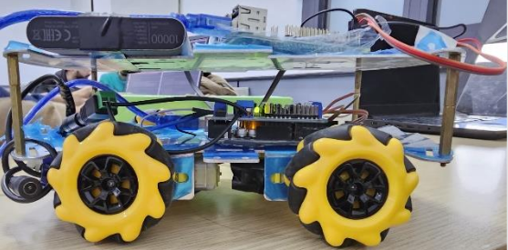

# **Mobile_Macnum_Robot**

The Macnum 4WD Mobile Robot represents a cutting-edge platform designed for versatile applications in various fields, including research, education, and industrial automation. Equipped with advanced robotics technology and controlled by ROS2 (Robot Operating System 2) and ROS1 as well, this platform offers seamless integration and robust performance. The integration of a joystick control system adds a user-friendly interface, allowing precise and intuitive manipulation of the robot's movements.

---------------------------
# Introduction

A Macnum wheel robot equipped with four omnidirectional wheels, designed to achieve seamless
omnidirectional motion. The robotic system employs advanced control mechanisms, utilizing a PID
controller for precise regulation of angular velocities. The key focus is on the calibration and testing
process, emphasizing sensor calibration, PID tuning, and kinematic model validation. The exclusion
of specific hardware components streamlines the calibration procedure, showcasing the significance
of gyroscopes and accelerometers for accurate internal state estimation. The closed-loop control
system demonstrates the robot's ability to move with some precise movement compared to the
hardware used. The successful calibration and testing efforts lay the groundwork for the robot's
reliable performance, offering promising prospects for further advancements in omnidirectional
robotic control systems.

--------------------------

# Assembly

To assemble this 4WD Macnum Mobile Robot, you need the following components:

- Raspberry Pi 3 model B+   
- Mecanum wheel x4
- Arduino Mega
- Motor driver shield
- IMU (MPU6050)
- DC motors x4
- Battery
- Power bank

Follow these steps to assemble YDPIbot:

1. Connect the Arduino Mega to the motor driver shield and the optical encoders and MPU6050 according to the pinout diagram provided in the documentation.
2. Connect the IMU to Raspberry Pi using the I2C interface and follow the instructions in the [mpu6050 pkg](https://github.com/PigeonSensei/pigeon_imu_driver/tree/master/mpu6050).
3. Mount the Raspberry Pi and the motor driver shield on the chassis of the robot using screws and standoffs.
4. Connect the DC motors to the motor driver shield and attach the wheels to the motor shafts.
5. Install the battery on the robot and connect it to the motor driver shield.
6. Install the power bank on the robot and connect it to the Raspberry Pi connected to the Arduino Mega.

---------------------------
# Installation

To use this mobile platform, you will need to install the following dependencies:

- [Python 3](https://www.python.org/downloads/)
- [Ubiquity Robotics image - Ubuntu 20.04](https://learn.ubiquityrobotics.com/noetic_pi_image_downloads) - for rasberry pi
- [ROS Noetic](http://wiki.ros.org/noetic/Installation) - the ubiquity robotics image have ROS noetic already
- [ROS Foxy](https://docs.ros.org/en/foxy/Installation.html) - On your Remote Device (Laptop for example).
- [MPU6050](https://github.com/PigeonSensei/pigeon_imu_driver/tree/master/mpu6050)
- [Joystick](https://www.youtube.com/watch?v=F5XlNiCKbrY) - use this youtube tutorial for controlling the robot with joystick
- Rosserial

---------------------------
### Installing Ubuntu20.04 on Raspberry PI

We recommend installing Ubuntu 20.04 and ROS noetic on the Raspberry Pi using the Ubiquity Robotics image. Follow these steps to install Ubuntu 20.04 using the Ubiquity Robotics image:

1. Download the Ubiquity Robotics image for Raspberry Pi from the [Ubiquity Robotics](https://learn.ubiquityrobotics.comnoetic_pi_image_downloads)

2. Flash the image to an SD card using a tool like Raspberry Pi Imager.

3. Insert the SD card into the Raspberry Pi and power it on.

4. Follow the on-screen instructions to complete the Ubuntu 20.04 installation process.

---------------------------
### Installing MPU6050 pkg

To install the MPU6050 pkg, follow these steps:

1. Open a terminal on your Raspberry Pi.

2. Clone the MPU6050 repository using the following command:

    `https://github.com/PigeonSensei/pigeon_imu_driver/tree/master/mpu6050`

3. Install wiringPi library from [here](http://wiringpi.com/download-and-install/)

4. Run some demo with the IMU to check if it's working.

--------------------------
### Installing Mecanum Mobilie Robot pkg

To install the Mecanum Mobile Robot package, follow these steps:

1. Open a terminal on your PC.

2. Navigate to your `catkin_ws/src` directory

3. Clone the Mecanum Robot ROS1 Package using the following command:

    `git clone https://github.com/Tarekshohdy688/Mobile_Macnum_Robot/tree/main/ROS1%20Package.git`

4. Navigate back to the main catkin_ws to build the pkg using the command:

    `catkin_make`

5. Navigate to your `colcon_ws/src` directory

6. Clone the Mecanum Robot ROS2 Package using the following command:

    `git clone https://github.com/Tarekshohdy688/Mobile_Macnum_Robot/tree/main/ROS2%20Package.git`

7. Navigate back to the main catkin_ws to build the pkg using the command:

    `colcon build`

-----------------------------
### Uploading Arduino Code

1. Open Arduino IDE and connect the arduino to your PC

2. Choose from tools/boards Arduino Mega 2560 and choose the port (Usually **/dev/ttyACM0** if you are running from Ubuntu)

3. Open the code in `~/catkin_ws/src/ydpibot/ydpibot_bringup/YDPIbot/YDPIbot.ino`

4. Upload the code and connect the Arduino to the raspberry pi.
